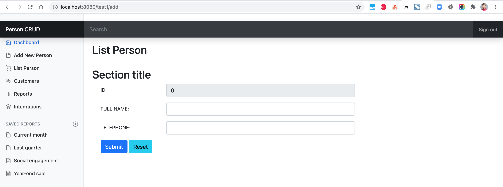
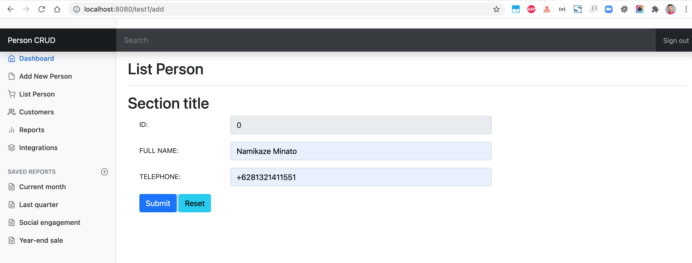
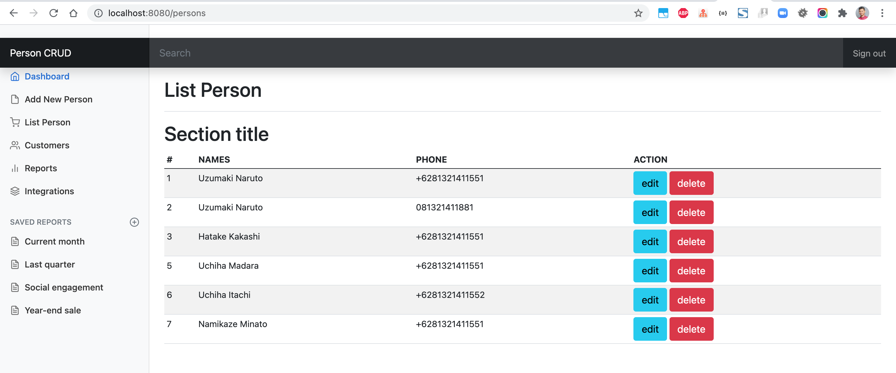
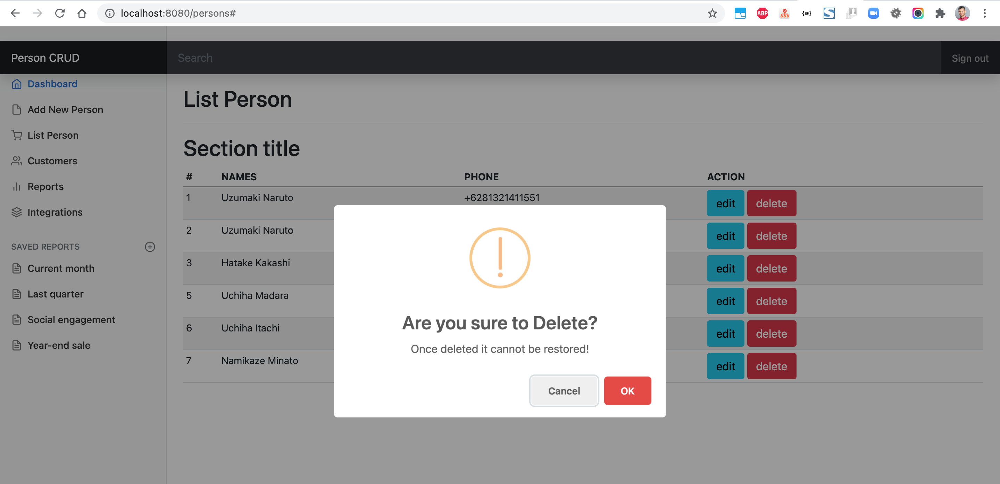

# spring-boot-person-crud

### Things to do list:

1. Clone this repository: `git clone https://github.com/hendisantika/spring-boot-person-crud.git`
2. Navigate to the folder: `cd spring-boot-person-crud`
3. Run the application: `mvn clean spring-boot:run`
4. Open your favorite browser: http://localhost:8080

### Images Screen shot

Add New Person

List All Persons

Delete Person

